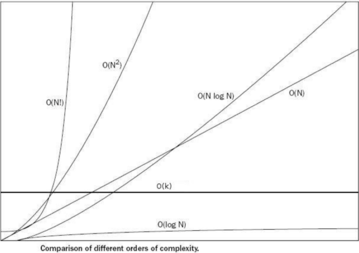

# 알고리즘 복잡도 표현 방법
어떤 문제를 푸는 알고리즘과 푸는 방법은 다양한 방법이 있을 수 있다. 이때 다양한 방법 중  어떤 방법이 더 좋은지를 판단하기 위해 복잡도를 정의하고 계산하고, 계산하는 방법은 시간 복잡도와 공간 복잡도로 나눌수 있다.  

1. 시간 복잡도 : 알고리즘을 **실행하는 속도**
2. 공간 복잡도 : 알고리즘이 사용하는 **메모리 사이즈**

컴퓨터와 서버의 스펙이 평균적으로 올라감에 따라 보통 공간 복잡도 보다는 시간 복잡도를 기준으로 많이 표현한다.  

## 알고리즘 성능 표기법
- 빅-오(Big-O) 표기법 : O(N)
  - 알고리즘 최악의 실행 시간을 표기한다.
  - **가장 많이/일반적으로 사용하는 방법이다.**
  - **아무리 최악의 상황이라도, 이 정도의 성능은 보장한다는 의미이기 때문에 많이 사용한다.**
- 오메가(Ω) 표기법: Ω(N)
    - 알고리즘 최상의 실행 시간을 표기한다.
- 세타(Θ) 표기법: Θ(N)
    - 오메가 표기법은 알고리즘 평균 실행 시간을 표기한다.

## Big-O 표기법
- O(입력)
    - O(1), O(logn), O(n), O(nlogn), O(n2), O(2n), O(n!)등으로 표기한다.
      - 입력 n의 크기에 따라 시간 복잡도가 계속 증가할 수 있다.
          - O(1) < O(logn) < O(n) < O(nlogn) < O(n2) < O(2n) < O(n!)
            - 단순하게 생각하면 입력되는 n에 따라 몇 번 실행이 되는지를 계산하면 된다.
                - n이 1이든 100이든, 100000이든, 표현식에 가장 큰 영향을 미치는 n의 단위로 표기한다.
                - 무조건 2회(상수회) 실행 : O(1)
              ````java
                      public class BigOTestClass {
                        public void O1Method() {
                            if(n > 10){
                              System.out.println(n);
                            }    
                        }
                      }
                  ````
         -  n에 따라 n번, n + 10번, 또는 3n + 10번 등 실행 : O(n)  
            - 이중 반복문의 경우 가장 바깥쪽에 있는 반복문은 상수 5번 반복하므로 5n 실행한다.    
             ````java
                        public class BigOTestClass {
                            public void On_Method() {
                                for(int num = 0; num < 5; num++) {
                                  for(int index = 0; i < index < n; index++) {
                                    System.out.println(index);
                                  }
                                }
                            } // method end
                        } // class end
            ````
        -   n에 따라, n2번, n2 + 1000 번, 100n2-100, 또는 300n2 + 1번 등 실행: O(n2)
             ````java
                        public class BigOTestClass {
                            public void On2_Method() {
                                for(int i = 0; i < 3; i++) {
                                  for(int num = 0; num < n; num++) {
                                    for(int index = 0; index < n; index++) {
                                        System.out.println(index);
                                    }
                                  }
                                }
                            } // method end
                        } // class end
            ````
  - **가장 바깥쪽에 있는 for문이 5번 반복이니까 그럼 5n이나 5n2으로 표기해야지 왜 그냥 n, n2으로 표기하는가?**
    - n이 1조로 설정되면 가장 바깥쪽 반복문의 상수는 의미가 없다고 본다. 즉, 가장 바깥쪽에 있는 상수와 상관없이 실질적으로 실행되는 **반복문의 횟수**가 중요하다.    
  